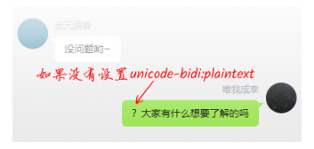

<!-- # 9.2 文字的旋转与阅读方向 -->

## 9.2.1 文字方向控制属性text-orientation

- `mixed`是默认值，表示中文和英文的文字显示方向是不一致的，中文字符是正立的，而英文字符则顺时针旋转90度后显示。
- `upright`表示中文和英文的文字显示方向都是默认的正立显示，没有旋转。
- `sideways`表示中文和英文的文字显示方向都是顺时针旋转90度。

[**text-orientation与垂直排版文字方向控制实例页面**](https://demo.cssworld.cn/new/9/2-1.php)


## 9.2.2 文字横向合并属性text-combine-upright

`text-combine-upright`属性可以让2～4个字符`横向合并`显示。例如：

```css
<p class="upright">
    <span>CSS</span>新世界
</p>

.upright {
 writing-mode: vertical-rl;
}
.upright span {
 -ms-text-combine-horizontal: all;
 -webkit-text-combine: horizontal;
 text-combine-upright: all;
}
```

text-combine-upright属性的语法如下：

```css
 text-combine-upright: none | all | digits <integer>?
 ```

 - `none`是默认值，表示字符不会参与横向合并；
 - `all`表示所有类型的字符都会参与横向合并，不过一个标签内最多只能合并4个字符；
 - `digits <integer>?`表示仅数字字符参与横向合并，这种语法多用在日期的垂直排版中，直接把text-combine-upright属性设置在容器元素上，里面的所有数字就会自动横向合并；此外，`<integer>`表示参与横向合并的数字的数量，可以不进行设置，此时会认为数量是2，数字范围不能在2～4之外，否则会被认为是不合法的。

**不过，目前没有任何浏览器支持`digits`关键字属性值，因此目前字符的横向合并效果只能使用关键字属性值`all`来实现。**

[**text-combine-upright与文字水平合并实例页面**](https://demo.cssworld.cn/new/9/2-2.php)

**兼容性**

- IE浏览器使用`-ms-text-combine-horizontal`属性实现字符的横向合并效果，其语法和text-combine-upright属性一样；
- Safari浏览器则使用`-webkit-text-combine`属性，且支持的属性值不是all，而是`horizontal`。
  
具体的兼容性如表9-5所示


**表9-5 text-combine-upright属性的兼容性（数据源自Caniuse网站）**


<br/>

## 9.2.3 了解unicode-bidi属性的新属性值

`unicode-bidi`属性总是和`direction`属性配合使用，用来设置字符水平流向的细节。过去，unicode-bidi属性支持下面这几个属性值：

```css
unicode-bidi: normal;
unicode-bidi: embed;
unicode-bidi: bidi-override;
```

在CSS新世界中，它又多支持了下面这3个值：

```css
unicode-bidi: plaintext;
unicode-bidi: isolate;
unicode-bidi: isolate-override;
```

[**unicode-bidi各个属性值的作用对比示意实例页面**](https://demo.cssworld.cn/new/9/2-3.php)

从`<button>`和`<span>`元素中字符的排序方向可以看出，属性值`isolate`对应传统的属性值`embed`，属性值`isolate-override`对应传统的属性值`bidi-override`，因为元素内的字符的双向算法是一样的，具体表现如下。

- 属性值isolate和embed的作用都是让中文字符和英文字符从左往右排列，让问号和加号等字符从右往左排列。
- 属性值isolate-override和bidi-override的作用都是让所有字符从右往左排列。

新属性值的不同之处就在于，isolate和isolate-override会让元素（即使是内联元素）作为独立的个体参与到兄弟元素之间的方位排列，其算法表现就如同图片、按钮元素，或者问号、加号等字符。

### 属性值plaintext

这里专门讲一下属性值`plaintext`。本身direction属性就很少使用，unicode-bidi属性更是几乎不用，属性值isolate和isolate-override又是为应对小众场景而设计的。我们在日常开发中使用属性值isolate和isolate-override的概率极低。因此，对于CSS新世界中的3个新属性值，只要关心使用概率更高的属性值plaintext即可。

**使用plaintext属性值可以在不改变当前文档的水平流向的前提下，让所有字符按照默认的从左往右的流向排列。**

在3.2节的CSS逻辑属性与对称布局实例中就用到过plaintext属性值（演示效果见[https://demo.cssworld.cn/new/3/2-3.php](https://demo.cssworld.cn/new/3/2-3.php)），演示效果中右侧的文字就使用了`unicode-bidi:plaintext`。因为中文的问号的排列算法是独立的，所以**如果没有设置unicode-bidi:plaintext声明，这个问号就会移到句子的最前面**，就会有图9-22所示的效果。




**图9-22 不使用unicode-bidi:plaintext声明的效果示意**

<br/>

虽然有时候重置direction属性值也有效果，但是direction属性值重置为ltr的时候，相关的CSS逻辑属性的方位也会颠倒，并会出现意料之外的布局状况。因此，建议使用unicode-bidi: plaintext声明，这样既可以让文字从左往右排列，又不会改变当前的文档流方向。